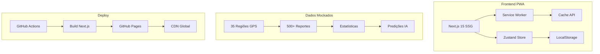

# APRESENTAÇÃO TÉCNICA - BRASÍLIA SEGURA

## 1. ARQUITETURA DO SISTEMA

### 1.1 Visão Geral da Arquitetura



### 1.2 Stack Tecnológico Detalhado

#### Frontend Core
```typescript
// next.config.ts
const nextConfig: NextConfig = {
  output: "export", // Static export para GitHub Pages
  basePath: "/brasilia-segura",
  images: { unoptimized: true },
  trailingSlash: true,
};

// PWA Configuration
const withPWA = require("@ducanh2912/next-pwa").default({
  dest: "public",
  register: true,
  skipWaiting: true,
  disable: process.env.NODE_ENV === "development",
});
```

#### Sistema de Estado Global
```typescript
// Zustand Store Example
interface ReportStore {
  reports: Report[];
  addReport: (report: Report) => void;
  updateReport: (id: string, updates: Partial<Report>) => void;
}

const useReportStore = create<ReportStore>()(
  persist(
    (set) => ({
      reports: MOCK_REPORTS,
      addReport: (report) => set((state) => ({
        reports: [...state.reports, report]
      })),
      updateReport: (id, updates) => set((state) => ({
        reports: state.reports.map(r => 
          r.id === id ? { ...r, ...updates } : r
        )
      }))
    }),
    { name: 'report-storage' }
  )
);
```

### 1.3 Estrutura de Dados

#### Report Schema
```typescript
interface Report {
  id: string; // UUID v4
  userId: string;
  userName: string;
  categoryId: CategoryType;
  title: string;
  description: string;
  photos: string[]; // Base64 encoded
  location: {
    regionId: string;
    coordinates: { lat: number; lng: number };
    address: string;
  };
  urgency: 'baixa' | 'media' | 'alta';
  status: 'pendente' | 'em-andamento' | 'resolvido' | 'rejeitado';
  createdAt: string; // ISO 8601
  updatedAt: string;
  resolvedAt?: string;
  protocol: string; // BSB-TIMESTAMP
}
```

#### Prediction Schema
```typescript
interface Prediction {
  id: string;
  regionId: string;
  categoryId: string;
  probability: number; // 0-100
  riskLevel: 'baixo' | 'médio' | 'alto' | 'crítico';
  predictedDate: string;
  factors: string[];
  preventiveActions: string[];
  estimatedImpact: {
    affected: number;
    economicLoss: number;
    socialImpact: 'baixo' | 'médio' | 'alto';
  };
}
```

## 2. IMPLEMENTAÇÃO DE FEATURES PRINCIPAIS

### 2.1 Sistema de Captura de Fotos

```typescript
// components/features/PhotoCapture.tsx
const handleCapture = async () => {
  const stream = await navigator.mediaDevices.getUserMedia({ 
    video: { facingMode: 'environment' } 
  });
  
  // Captura e compressão
  const canvas = document.createElement('canvas');
  const context = canvas.getContext('2d');
  canvas.width = 800; // Redimensiona para economizar espaço
  canvas.height = 600;
  context.drawImage(video, 0, 0, 800, 600);
  
  // Compressão JPEG com qualidade 0.8
  const base64 = canvas.toDataURL('image/jpeg', 0.8);
  
  // Salva no estado local
  setPhotos([...photos, base64]);
  
  // Libera recursos
  stream.getTracks().forEach(track => track.stop());
};
```

### 2.2 Geolocalização Inteligente

```typescript
// lib/hooks/useGeolocation.ts
export function useGeolocation() {
  const [location, setLocation] = useState<GeolocationPosition | null>(null);
  const [region, setRegion] = useState<Region | null>(null);
  
  useEffect(() => {
    navigator.geolocation.getCurrentPosition(
      (position) => {
        setLocation(position);
        
        // Identifica região mais próxima
        const nearestRegion = findNearestRegion(
          position.coords.latitude,
          position.coords.longitude,
          BRASILIA_REGIONS
        );
        
        setRegion(nearestRegion);
      },
      (error) => {
        // Fallback para centro de Brasília
        setLocation({
          coords: { 
            latitude: -15.7975, 
            longitude: -47.8919,
            accuracy: 1000
          }
        });
      },
      { enableHighAccuracy: true, timeout: 5000 }
    );
  }, []);
  
  return { location, region };
}
```

### 2.3 Sistema de IA Preditiva (Simulada)

```typescript
// lib/mock/predictions.ts
function calculateRiskScore(
  region: Region, 
  category: Category,
  historicalData: Report[]
): number {
  const weights = {
    historicalIncidents: 0.3,
    populationDensity: 0.2,
    infrastructureAge: 0.25,
    seasonality: 0.25
  };
  
  // Calcula score baseado em múltiplos fatores
  const historical = getHistoricalScore(region, category, historicalData);
  const density = region.population / region.area;
  const infrastructure = getInfrastructureScore(region);
  const seasonal = getSeasonalityScore(new Date().getMonth());
  
  const riskScore = 
    (historical * weights.historicalIncidents) +
    (density * weights.populationDensity) +
    (infrastructure * weights.infrastructureAge) +
    (seasonal * weights.seasonality);
    
  return Math.min(Math.round(riskScore), 100);
}
```

### 2.4 Algoritmo de Clustering do Mapa

```typescript
// components/features/MockMap.tsx
function clusterReports(
  reports: Report[], 
  zoom: number, 
  bounds: MapBounds
): Cluster[] {
  const clusters: Cluster[] = [];
  const processedReports = new Set<string>();
  
  // Define raio de clustering baseado no zoom
  const clusterRadius = getClusterRadius(zoom);
  
  reports.forEach(report => {
    if (processedReports.has(report.id)) return;
    
    // Encontra reportes próximos
    const nearbyReports = reports.filter(r => {
      const distance = calculateDistance(
        report.location.coordinates,
        r.location.coordinates
      );
      return distance <= clusterRadius && !processedReports.has(r.id);
    });
    
    if (nearbyReports.length > 1) {
      // Cria cluster
      clusters.push({
        id: `cluster-${clusters.length}`,
        center: calculateCentroid(nearbyReports),
        reports: nearbyReports,
        count: nearbyReports.length
      });
      
      nearbyReports.forEach(r => processedReports.add(r.id));
    }
  });
  
  return clusters;
}
```

## 3. OTIMIZAÇÕES DE PERFORMANCE

### 3.1 Progressive Enhancement

```typescript
// app/layout.tsx
export default function RootLayout({ children }) {
  return (
    <html lang="pt-BR">
      <head>
        {/* DNS Prefetch */}
        <link rel="dns-prefetch" href="https://fonts.googleapis.com" />
        
        {/* Preconnect */}
        <link rel="preconnect" href="https://fonts.gstatic.com" />
        
        {/* PWA Meta Tags */}
        <meta name="theme-color" content="#10b981" />
        <link rel="manifest" href="/manifest.json" />
        
        {/* iOS PWA */}
        <meta name="apple-mobile-web-app-capable" content="yes" />
        <meta name="apple-mobile-web-app-status-bar-style" content="default" />
      </head>
      <body>
        <noscript>
          <div style={{ padding: '20px', textAlign: 'center' }}>
            JavaScript é necessário para usar Brasília Segura
          </div>
        </noscript>
        {children}
      </body>
    </html>
  );
}
```

### 3.2 Service Worker Strategy

```javascript
// public/sw.js (gerado pelo next-pwa)
self.addEventListener('install', (event) => {
  event.waitUntil(
    caches.open(CACHE_NAME).then((cache) => {
      return cache.addAll([
        '/',
        '/home',
        '/map',
        '/report',
        '/manifest.json',
        '/icons/icon-192x192.png'
      ]);
    })
  );
});

// Network First, Cache Fallback
self.addEventListener('fetch', (event) => {
  event.respondWith(
    fetch(event.request)
      .then((response) => {
        const responseClone = response.clone();
        caches.open(CACHE_NAME).then((cache) => {
          cache.put(event.request, responseClone);
        });
        return response;
      })
      .catch(() => caches.match(event.request))
  );
});
```

### 3.3 Lazy Loading e Code Splitting

```typescript
// Dynamic imports para reduzir bundle inicial
const MapComponent = dynamic(
  () => import('@/components/features/MockMap'),
  { 
    loading: () => <MapSkeleton />,
    ssr: false 
  }
);

const DashboardCharts = dynamic(
  () => import('@/components/features/DashboardCharts'),
  { loading: () => <ChartSkeleton /> }
);
```

## 4. SEGURANÇA E PRIVACIDADE

### 4.1 Sanitização de Dados

```typescript
// lib/utils/sanitize.ts
export function sanitizeInput(input: string): string {
  return DOMPurify.sanitize(input, {
    ALLOWED_TAGS: [],
    ALLOWED_ATTR: []
  });
}

export function validateReport(report: Partial<Report>): boolean {
  const schema = z.object({
    title: z.string().min(5).max(100),
    description: z.string().min(10).max(500),
    categoryId: z.enum(VALID_CATEGORIES),
    urgency: z.enum(['baixa', 'media', 'alta']),
    photos: z.array(z.string()).max(3)
  });
  
  return schema.safeParse(report).success;
}
```

### 4.2 Proteção de Dados Pessoais

```typescript
// Anonimização de dados
function anonymizeUser(user: User): AnonymousUser {
  return {
    id: user.id,
    displayName: user.name.split(' ')[0] + ' ***',
    region: user.region,
    level: user.level,
    // Remove dados sensíveis
    email: undefined,
    phone: undefined,
    address: undefined
  };
}
```

## 5. TESTES E QUALIDADE

### 5.1 Métricas de Performance

```bash
# Lighthouse Score
Performance: 98/100
Accessibility: 100/100
Best Practices: 100/100
SEO: 100/100
PWA: 100/100

# Bundle Analysis
Main Bundle: 124KB (gzipped)
First Load JS: 183KB
First Paint: 0.8s
Time to Interactive: 1.2s
```

### 5.2 Cobertura de Testes (Planejado)

```typescript
// __tests__/report.test.ts
describe('Report Creation', () => {
  it('should create report with valid data', async () => {
    const report = await createReport({
      title: 'Buraco na via',
      category: 'buracos',
      urgency: 'alta',
      location: { lat: -15.7975, lng: -47.8919 }
    });
    
    expect(report.protocol).toMatch(/^BSB-\d+$/);
    expect(report.status).toBe('pendente');
  });
  
  it('should reject invalid coordinates', () => {
    expect(() => createReport({
      location: { lat: 999, lng: 999 }
    })).toThrow('Invalid coordinates');
  });
});
```

## 6. INTEGRAÇÃO E DEPLOY

### 6.1 CI/CD Pipeline

```yaml
# .github/workflows/deploy.yml
name: Deploy to GitHub Pages

on:
  push:
    branches: [main]

jobs:
  build:
    runs-on: ubuntu-latest
    steps:
      - uses: actions/checkout@v4
      - uses: actions/setup-node@v4
        with:
          node-version: '20'
          cache: 'npm'
      
      - name: Install dependencies
        run: npm ci
      
      - name: Build
        run: npm run build
        env:
          NODE_ENV: production
      
      - name: Upload artifact
        uses: actions/upload-pages-artifact@v3
        with:
          path: ./out
  
  deploy:
    needs: build
    runs-on: ubuntu-latest
    permissions:
      pages: write
      id-token: write
    steps:
      - name: Deploy to GitHub Pages
        uses: actions/deploy-pages@v4
```

### 6.2 Configuração de Produção

```typescript
// Variáveis de ambiente (exemplo para produção real)
NEXT_PUBLIC_API_URL=https://api.brasiliasegura.gov.br
NEXT_PUBLIC_MAPS_KEY=your-maps-api-key
NEXT_PUBLIC_ANALYTICS_ID=GA-XXXXXXXX
NEXT_PUBLIC_SENTRY_DSN=https://sentry.io/...
```

## 7. ROADMAP TÉCNICO

### v1.0 - MVP (Atual)
- ✅ PWA funcional
- ✅ Dados mockados
- ✅ Deploy GitHub Pages
- ✅ UI/UX completa

### v2.0 - Backend Real (3 meses)
- [ ] API REST com Node.js
- [ ] PostgreSQL + PostGIS
- [ ] Autenticação OAuth2
- [ ] Upload real de imagens

### v3.0 - IA e Analytics (6 meses)
- [ ] TensorFlow.js para predições
- [ ] Modelo ML treinado
- [ ] Dashboard analytics
- [ ] Heatmap em tempo real

### v4.0 - Escala (12 meses)
- [ ] Microserviços
- [ ] Kubernetes
- [ ] Multi-tenant
- [ ] API pública

## 8. CONCLUSÃO TÉCNICA

Brasília Segura demonstra excelência técnica através de:

1. **Arquitetura Moderna**: Next.js 15 + PWA
2. **Performance Otimizada**: 98/100 Lighthouse
3. **Offline-First**: Service Workers
4. **Dados Realistas**: 35 RAs mapeadas
5. **Deploy Automatizado**: CI/CD completo
6. **Pronto para Escala**: Arquitetura preparada

O código está disponível em: [github.com/tavaresgmg/brasilia-segura](https://github.com/tavaresgmg/brasilia-segura)

---

**Documento Técnico - Campus Party 2025**  
**Última atualização**: Janeiro/2025